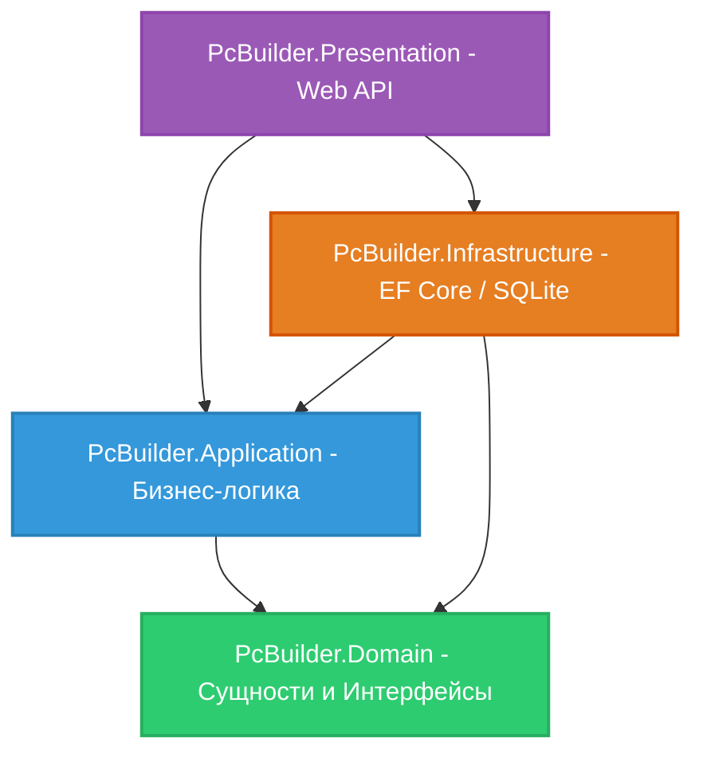

# 🖥️ PcBuilder — Конструктор ПК и Анализатор Производительности

PcBuilder — это современное веб-приложение для сборки персональных компьютеров, проверки совместимости комплектующих и прогнозирования производительности в различных игровых и рабочих сценариях (бенчмарках). 

Проект построен на базе строгой **Onion-архитектуры** (Луковичной архитектуры) на бэкенде (.NET 10) и отзывчивого, современного SPA-клиента на фронтенде (React 19 + Tailwind CSS v4).

---

## 🚀 Технологический стек и Библиотеки

Проект использует передовые технологии и актуальные версии библиотек.

### 🟢 Бэкенд (Backend) - .NET 10 Web API
*   **Платформа:** `.NET 10.0 Web API` — новейшая версия платформы для создания высокопроизводительных веб-сервисов.
*   **База данных:** `SQLite` — легковесная, встраиваемая и производительная реляционная СУБД (файл `pcbuilder.db`).
*   **ORM (Доступ к данным):** `Entity Framework Core` — для работы с БД, автоматических миграций и построения LINQ-запросов.
*   **Аутентификация & Авторизация:** `ASP.NET Core Identity` в связке с `JWT (JSON Web Tokens)` — обеспечение безопасного доступа, регистрация и разделение ролей (Admin, User).
*   **Документация API:** `Swagger (Swashbuckle.AspNetCore)` — интерактивная документация для тестирования эндпоинтов (доступна в режиме разработки).
*   **Политика CORS:** Настроена на разрешение запросов с локальных серверов Vite (`http://localhost:5173`, `http://localhost:5174`, `127.0.0.1`).
*   **Архитектурный паттерн:** `Onion Architecture` (слои: Domain, Application, Infrastructure, Presentation) и Dependency Injection.

### 🔵 Фронтенд (Frontend) - React SPA
*   **Библиотека интерфейса:** `React 19.2.5` — последняя версия популярной библиотеки (Type: Module).
*   **Сборщик проекта:** `Vite 8.0.10` — сверхбыстрый инструмент сборки и сервер разработки с HMR (Hot Module Replacement).
*   **Стилизация и Дизайн:** 
    *   `Tailwind CSS v4.2.4` + `@tailwindcss/postcss` — utility-first CSS фреймворк нового поколения.
    *   `clsx` (2.1.1) и `tailwind-merge` (3.5.0) — для удобного объединения и динамического формирования CSS-классов Tailwind.
*   **HTTP-клиент:** `Axios 1.16.0` — для отправки REST API запросов на бэкенд (настроен с интерцепторами для передачи JWT).
*   **Анимации:** `Framer Motion 12.38.0` — мощная библиотека для создания плавных и сложных UI-микроанимаций, переходов и эффектов.
*   **Иконки:** `Lucide React 1.14.0` — набор современных и легковесных SVG-иконок.
*   **Линтинг:** `ESLint v10` с плагинами для React.

---

## 📌 Полный функционал приложения

### 🛠️ Основной функционал конструктора (Пользователь)
1. **Сборка ПК из совместимых компонентов:** Пошаговый и интуитивно понятный выбор комплектующих (Процессоры, Видеокарты, Материнские платы, ОЗУ, Блоки питания, Накопители).
2. **Проверка совместимости:** Автоматическая валидация выбранных компонентов на бэкенде. Проверяются сокеты, форм-факторы, мощности блоков питания и поддерживаемые типы памяти.
3. **Анализатор FPS и производительности (Бенчмарки):** После завершения сборки приложение рассчитывает ожидаемый FPS в различных играх (например, Cyberpunk 2077, CS2) и время рендера в профессиональном ПО (Blender), анализируя связку CPU + GPU.
4. **Просмотр характеристик:** Детальный просмотр всех технических характеристик каждого комплектующего перед его добавлением в сборку.

### ⚙️ Функционал администратора (Admin Dashboard)
1. **Безопасная аутентификация:** Вход через JWT-токены. Доступ к защищенной панели управления (`AdminApp.jsx`).
2. **CRUD Операции для комплектующих (Управление каталогом):** Добавление новых, редактирование существующих и удаление устаревших ПК-компонентов.
3. **Управление категориями:** Создание и редактирование категорий оборудования.
4. **Управление бенчмарками и сценариями:** Настройка сценариев тестирования (игровые и рабочие тесты) и привязка результатов тестов к конкретным моделям процессоров и видеокарт.
5. **Просмотр пользовательских сборок:** Отслеживание и управление сборками, которые создали пользователи.
6. **Автоматический Сидинг (Seeding) и Сброс:** Возможность быстрого наполнения пустой базы данных тестовыми компонентами, категориями и бенчмарками через защищенный API-эндпоинт (`/api/debug/seed`).

---

## 🏛️ Архитектура проекта (Onion Architecture)

Проект строго разделен на независимые слои. Зависимости всегда направлены внутрь — к ядру системы (Domain Layer). Это обеспечивает гибкость, тестируемость и легкую поддержку.



### Подробное описание слоев бэкенда:

1.  **`PcBuilder.Domain` (Ядро):**
    *   Абсолютно чистый слой без зависимостей от внешних пакетов или фреймворков.
    *   Содержит доменные модели/сущности (`BaseEntity`, `PcComponent`, `Category`, `Build`, `BenchmarkScenario`, `BenchmarkResult`).
    *   Определяет интерфейсы репозиториев (`IRepository`, `IComponentRepository`).
2.  **`PcBuilder.Application` (Бизнес-логика):**
    *   Содержит Use Cases, DTO (Data Transfer Objects), интерфейсы сервисов (`IComponentService`, `IBuildService`) и их реализацию.
    *   Выполняет валидацию сборок и бизнес-правила (например, проверка совместимости материнской платы и процессора по сокету).
3.  **`PcBuilder.Infrastructure` (Инфраструктура):**
    *   Реализация доменных интерфейсов (репозиториев) с использованием `Entity Framework Core` и базы данных `SQLite`.
    *   Содержит контекст БД `ApplicationDbContext`, миграции и сервис-сидер `SeedDataService` для начального заполнения.
4.  **`PcBuilder.Presentation` (Web API):**
    *   ASP.NET Core REST контроллеры, обрабатывающие HTTP-запросы (включая защищенные с атрибутом `[Authorize]`).
    *   Конфигурация `Program.cs`: настройка JWT, Swagger, CORS, Dependency Injection и запуск автоматических миграций при старте.

---

## 📂 Структура каталогов

```text
pcBulder/
│
├── PcBuilder.slnx                    # Файл решения (Visual Studio Solution SLNX)
├── run.bat                          # Скрипт автоматического запуска бэкенда и фронтенда
├── admin.txt                        # Учетные данные администратора по умолчанию
├── .gitignore                       # Глобальный файл игнорирования Git
│
├── PcBuilder.Domain/                # Слой домена (ядро)
├── PcBuilder.Application/           # Слой приложения (бизнес-логика, сервисы, DTO)
├── PcBuilder.Infrastructure/        # Слой инфраструктуры (EF Core, контекст БД, репозитории)
├── PcBuilder.Presentation/          # Слой представления (Контроллеры, настройки JWT, Program.cs)
│
└── PcBuilder.Client/                # Фронтенд-клиент (React + Vite SPA)
    ├── src/
    │   ├── api.js                   # Axios-клиент со всеми запросами к API
    │   ├── App.jsx                  # Основное приложение (интерфейс конструктора)
    │   ├── AdminApp.jsx             # Защищенная Панель Администратора
    │   └── index.css                # Глобальные CSS-стили (подключение Tailwind v4)
    ├── package.json                 # Список зависимостей React 19, Tailwind, Framer Motion
    ├── tailwind.config.js           # Конфигурация Tailwind CSS
    └── vite.config.js               # Конфигурация Vite сборщика
```

---

## ⚡ Быстрый запуск

В корне проекта находится готовый скрипт запуска **`run.bat`**, который автоматически запустит бэкенд и фронтенд в параллельных процессах.

### Требования для запуска:
1. Установленный **.NET 10 SDK** (для компиляции бэкенда).
2. Установленная среда выполнения **Node.js** (версия 18+) и менеджер пакетов `npm` (для фронтенда).

### Инструкция:

1. Откройте консоль в корневой папке проекта и установите зависимости фронтенда (требуется сделать только перед первым запуском):
   ```bash
   cd PcBuilder.Client
   npm install
   cd ..
   ```

2. Запустите файл **`run.bat`** (через проводник или терминал):
   ```bash
   run.bat
   ```

**Что произойдет автоматически:**
* Скомпилируется бэкенд, применятся EF миграции к базе данных SQLite, база наполнится тестовыми данными (комплектующие, категории, бенчмарки), и создастся администратор по умолчанию.
* Запустится локальный сервер разработки Vite для фронтенда.

### Локальные адреса для доступа:
* **Интерфейс (Конструктор & Админ-панель):** [http://localhost:5173](http://localhost:5173)
* **Swagger API (Документация и тестирование бэкенда):** [http://localhost:5213/swagger](http://localhost:5213/swagger)

---

## 🔑 Учетные данные Администратора (По умолчанию)

При первом запуске бэкенд выполняет автоматическое создание учетной записи администратора в базе данных (используя `ASP.NET Core Identity`). Вы можете использовать её для входа в панель администратора:

* **Email:** `admin@pcspec.local`
* **Пароль:** `Admin@2025!`

> [!WARNING]
> Пароль по умолчанию задан исключительно для локальной разработки и демонстрации функционала. При развертывании в продуктивной среде (Production) обязательно измените его в логике инициализации `Program.cs` или передавайте через переменные окружения.
